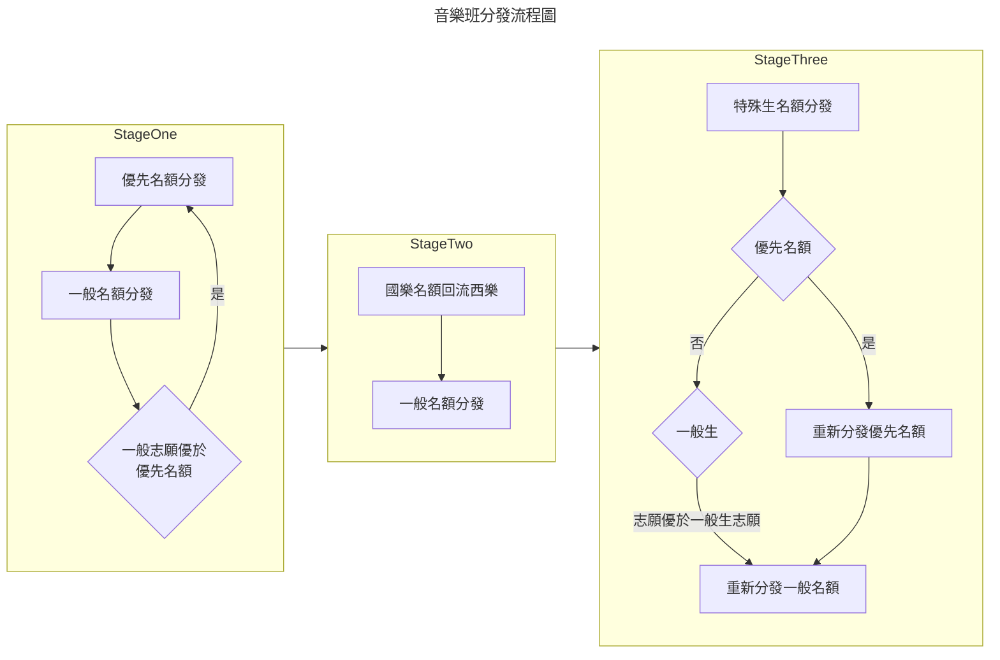

---
tags:
  - WKE
draft: true
---
## 班別

* 美術班
* 音樂班
* 舞蹈班

> [!INFO] 
> 一般名額（以競賽表現入學、甄選入學聯合分發）每校共計招收25人
外加名額（原住民學生、身心障礙學生）每校共計2人

> [!important]
> 最低錄取分數：以所有學生（含特殊生）**第一階段分發完成後，取得各校最後錄取學生之成績**，作為特殊生以外加名額錄取該校門檻（加分優待甄選總成績大於或等於最低錄取分數）

## 美術班分發

### 流程

Step 1. 一般生與特殊生一起分發 → 得到各校特殊生錄取門檻

該步驟會額外維護兩個Queue

1. 特殊生：如果碰到就新增
2. 可遞補生：如果非以第一志願上榜則新增

Step 2. 

## 音樂班

| 學校  | 樂器  | 優先名額 | 一般名額 | 當前優先 | 當前一般 |
| --- | --- | ---- | ---- | ---- | ---- |
| A   | 鋼琴  | 1    | 3    |      |      |
| A   | 鼓   | 1    | 3    |      |      |
| B   | 鋼琴  | 1    | 3    |      |      |
| B   | 鼓   | 1    | 3    |      |      |

> [!NOTE]
> * 如果一般名額已達上限那麼優先名額一定也滿了

A 2/3 
B 2/3

